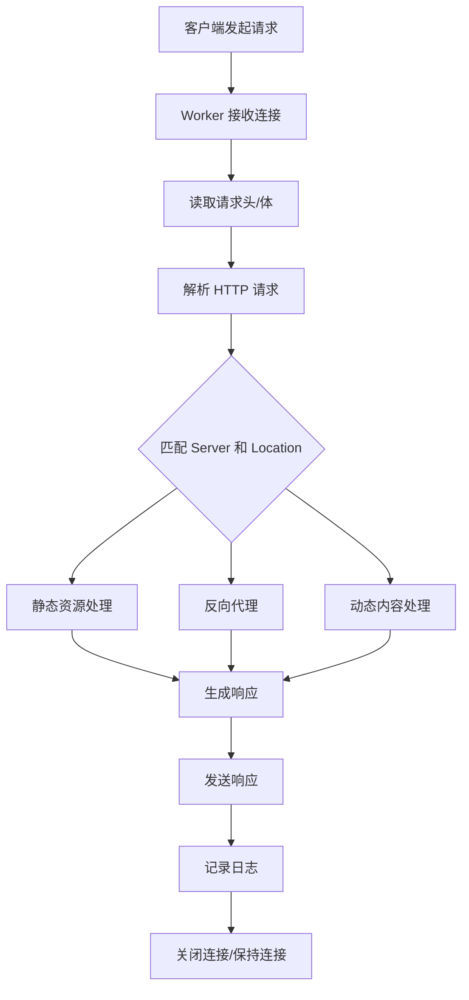

---

UID: 20250325235921 
alias: 
tags: 
source: 
cssclass: 
obsidianUIMode: preview
obsidianEditingMode: live
created: 2025-03-25
---


---

### **Nginx 处理 HTTP 请求的完整流程**

Nginx 通过 **事件驱动** 和 **异步非阻塞 I/O 模型** 高效处理 HTTP 请求，其核心流程可分为以下阶段：

---

#### **1. 接收连接**
- **监听端口**：Nginx 的 Master 进程启动后，Worker 进程监听配置的端口（如 80、443）。
- **事件驱动**：通过 `epoll`（Linux）、`kqueue`（FreeBSD/ macOS）等系统调用，异步监听 Socket 事件。
- **TCP 握手**：完成三次握手后，建立客户端连接。

---

#### **2. 读取请求**
- **非阻塞读取**：Worker 进程从 Socket 中异步读取请求头和请求体（若存在）。
- **内存池管理**：每个连接分配独立的内存池，避免频繁内存分配。

---

#### **3. 解析请求**
- **解析请求行**：提取 HTTP 方法（GET/POST）、URI、协议版本。
  ```http
  GET /index.html HTTP/1.1
  ```
- **解析请求头**：提取 `Host`、`User-Agent`、`Cookie` 等头信息。
- **验证请求**：检查协议合规性（如 HTTP 版本支持）。

---

#### **4. 匹配 Server 和 Location**
- **匹配 Server 块**：根据 `Host` 头找到对应的 `server` 配置块。
  ```nginx
  server {
      listen 80;
      server_name example.com;  # 匹配域名
      ...
  }
  ```
- **匹配 Location 块**：根据 URI 匹配最合适的 `location` 规则。
  ```nginx
  location /static/ { ... }     # 前缀匹配
  location ~ \.php$ { ... }     # 正则匹配
  ```

---

#### **5. 处理请求**
根据匹配到的 `location` 配置，执行不同操作：

##### **5.1 静态资源服务**
- **直接返回文件**：如 HTML、CSS、JS、图片。
- **优化机制**：
  - `sendfile`：零拷贝技术，直接通过内核发送文件。
  - `gzip`：压缩响应内容，减少传输体积。
  - `expires`：设置浏览器缓存头（如 `Cache-Control`）。

##### **5.2 反向代理**
- **转发请求**：将请求代理到后端服务器（如 Tomcat、Node.js）。
  ```nginx
  location /api/ {
      proxy_pass http://backend_server;
      proxy_set_header Host $host;
  }
  ```
- **负载均衡**：按策略（轮询、IP Hash 等）选择后端节点。
  ```nginx
  upstream backend_server {
      server 10.0.0.1:8080;
      server 10.0.0.2:8080;
  }
  ```

##### **5.3 动态内容处理**
- **FastCGI 代理**：处理 PHP、Python 等动态请求。
  ```nginx
  location ~ \.php$ {
      fastcgi_pass unix:/var/run/php-fpm.sock;
      include fastcgi_params;
  }
  ```

##### **5.4 访问控制**
- **IP 限制**：允许或拒绝特定 IP。
  ```nginx
  location /admin/ {
      allow 192.168.1.0/24;
      deny all;
  }
  ```
- **速率限制**：限制请求频率。
  ```nginx
  limit_req_zone $binary_remote_addr zone=req_limit:10m rate=10r/s;
  ```

---

#### **6. 生成响应**
- **构建响应头**：设置状态码（如 200、404）、`Content-Type`、`Content-Length` 等。
- **发送响应体**：分块传输或一次性发送。

---

#### **7. 日志记录**
- **访问日志**：记录请求详情到 `access.log`。
  ```nginx
  log_format main '$remote_addr - $request_time';
  access_log /var/log/nginx/access.log main;
  ```
- **错误日志**：记录异常信息到 `error.log`。
  ```nginx
  error_log /var/log/nginx/error.log warn;
  ```

---

#### **8. 连接关闭**
- **保持连接**：若启用 `keepalive`，复用 TCP 连接处理多个请求。
- **超时关闭**：通过 `keepalive_timeout` 控制空闲连接关闭时间。

---

### **Nginx 高性能的底层原理**

#### **1. 事件驱动模型**
- **异步非阻塞 I/O**：Worker 进程通过事件循环处理多个连接，避免线程阻塞。
- **多阶段处理**：将请求拆分为多个阶段（如读取、解析、响应），每个阶段非阻塞执行。

#### **2. 多进程架构**
- **Master-Worker 模式**：
  - **Master 进程**：管理配置、监控 Worker。
  - **Worker 进程**：实际处理请求，数量通常等于 CPU 核数。
- **无锁竞争**：Worker 进程相互独立，避免共享资源竞争。

#### **3. 内存优化**
- **内存池**：为每个连接分配独立内存池，减少内存碎片。
- **高效数据结构**：使用红黑树、哈希表快速匹配 Server 和 Location。

---

### **请求处理流程图**


---

### **总结**
Nginx 通过 **事件驱动、非阻塞 I/O、多进程架构** 和 **高效内存管理**，实现了高并发下的低延迟与高吞吐。其模块化设计允许灵活配置，支持静态服务、反向代理、负载均衡、缓存加速等多样化场景。理解其处理流程与底层原理，有助于优化配置并构建高性能 Web 服务。
