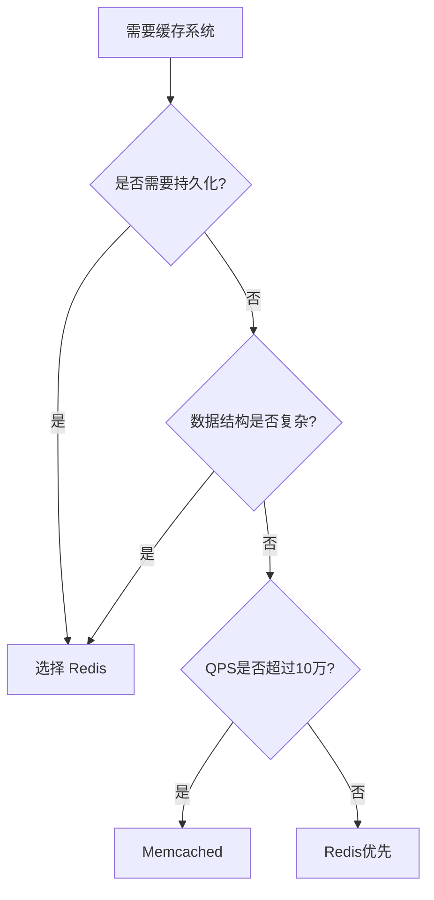

---

UID: 20250326160308 
alias: 
tags: 
source: 
cssclass: 
obsidianUIMode: preview
obsidianEditingMode: live
created: 2025-03-26
---

在缓存系统的选型中，Redis 和 Memcached 都是经典的内存数据存储方案，但两者的设计目标和适用场景存在显著差异。以下是 Redis 相比 Memcached 的核心优势及选择建议：

---

### **一、架构与功能对比**
| **对比维度**         | **Redis**                                      | **Memcached**                          |
|----------------------|-----------------------------------------------|----------------------------------------|
| **数据模型**         | 支持 8+ 种数据结构（String/Hash/List/Set/ZSet等） | 仅 Key-Value 结构                      |
| **持久化**           | 支持 RDB 快照和 AOF 日志                        | 无持久化，重启后数据丢失               |
| **线程模型**         | 单线程（避免锁竞争，原子性操作）               | 多线程（多核利用率高）                 |
| **内存管理**         | 动态内存分配，支持不同大小的数据               | 预分配内存池（适合固定大小数据块）     |
| **数据分片**         | 原生支持 Cluster 分片                          | 依赖客户端一致性哈希                   |
| **高级功能**         | 支持事务、Lua脚本、发布订阅、Stream消息队列     | 无高级功能，纯缓存                     |
| **适用场景**         | 缓存 + 实时计算 + 消息中间件                   | 纯缓存场景                            |

---

### **二、选择 Redis 的六大核心理由**
#### 1. **丰富的数据结构支持**
Redis 的多数据结构可直接解决业务问题，**减少代码复杂度**：
- **排行榜**：用 `Sorted Set` 实现实时排序（`ZADD`/`ZRANGE`）
- **社交关系**：用 `Set` 计算共同好友（`SINTER`）
- **对象存储**：用 `Hash` 存储用户属性（`HGETALL`）
- **消息队列**：用 `List` 或 `Stream` 实现异步通信

**Memcached 局限**：需在客户端实现复杂逻辑（如 JSON 序列化/反序列化），增加网络开销。

#### 2. **数据持久化保障**
Redis 的持久化机制可**防止缓存雪崩后的数据重建压力**：
- **RDB（快照）**：定时全量备份，恢复速度快
- **AOF（追加日志）**：记录所有写操作，数据完整性高
- **混合模式**：Redis 4.0+ 结合 RDB 和 AOF 优势

**Memcached 风险**：宕机或重启后数据全量丢失，需从数据库重新加载，可能引发缓存穿透。

#### 3. **原子性与事务支持**
Redis 提供**服务端原子操作**，避免并发问题：
- **原子命令**：`INCR`（计数器）、`SETNX`（分布式锁）
- **Lua 脚本**：保证复杂逻辑的原子执行
  ```lua
  -- 扣减库存的原子操作
  local stock = redis.call('GET', KEYS[1])
  if tonumber(stock) > 0 then
      redis.call('DECR', KEYS[1])
      return 1  -- 成功
  else
      return 0  -- 失败
  end
  ```
- **事务**：`MULTI`/`EXEC` 实现命令批处理（非严格 ACID）

**Memcached 局限**：无原子操作支持，需客户端实现锁机制。

#### 4. **高可用与扩展性**
Redis 提供**企业级集群方案**：
- **主从复制**：读写分离提升吞吐量
- **Sentinel**：自动故障转移（Failover）
- **Cluster 模式**：数据自动分片（16384 slots），支持水平扩展

**Memcached 限制**：依赖客户端分片（如一致性哈希），扩容时需迁移数据。

#### 5. **内存优化能力**
Redis 通过编码优化**节省内存空间**：
- **ziplist**：压缩列表存储小数据（Hash/List/ZSet）
- **quicklist**：链表 + ziplist 平衡性能和内存
- **HyperLogLog**：12KB 内存统计亿级 UV

**Memcached 局限**：内存利用率较低（固定内存块分配，可能产生碎片）。

#### 6. **生态与功能扩展**
Redis 的**模块化架构**支持功能扩展：
- **RediSearch**：全文搜索引擎
- **RedisGraph**：图数据库
- **RedisTimeSeries**：时序数据处理
- **Bloom Filter**：布隆过滤器（防缓存穿透）

---

### **三、Memcached 的适用场景**
尽管 Redis 功能更强大，但 Memcached 在以下场景仍有价值：
1. **纯 Key-Value 缓存**：无需复杂数据结构
2. **大规模静态数据缓存**：如 HTML 片段、图片元数据
3. **高并发简单查询**：Memcached 多线程模型在极端 QPS 下可能表现更优
4. **内存利用率敏感场景**：数据大小均匀时，Memcached 的预分配内存池碎片更少

---

### **四、性能对比与压测数据**
| **场景**              | **Redis QPS** | **Memcached QPS** | **结论**                     |
|-----------------------|---------------|--------------------|------------------------------|
| 单键读写（小数据）    | 120,000       | 150,000            | Memcached 略高（多线程优势） |
| 批量操作（Pipeline）  | 500,000+      | 不支持             | Redis 胜出                   |
| 复杂操作（ZSet 排序） | 80,000        | 不支持             | Redis 独占优势               |

---

### **五、选型决策树**


---

### **六、经典案例解析**
**某社交平台 feed 流系统升级：**
1. **原始方案**：Memcached 缓存用户动态（JSON 字符串）
   - 痛点：每次读取需反序列化整个对象，网络开销大
2. **升级方案**：改用 Redis Hash 结构存储字段
   - 优化点：按需获取字段（`HGET`），流量降低 40%
   - 新增功能：用 ZSet 实现 feed 流按时间排序

---

### **总结建议**
- **优先选择 Redis**：90% 的场景下 Redis 的综合优势更明显
- **仅在下述情况选择 Memcached**：
  - 业务模型仅为简单 Key-Value 缓存
  - 数据大小均匀且无需持久化
  - 极端 QPS 需求（如 >20万/秒）且可接受数据丢失风险
- **混合架构**：超大流量场景可同时使用两者，Redis 处理复杂业务，Memcached 承担基础缓存


