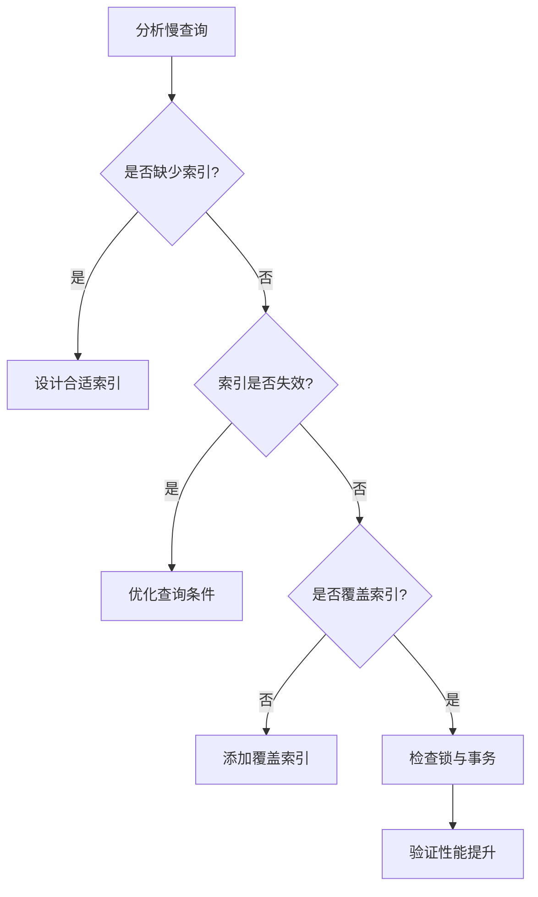

---

UID: 20250325182631 
alias: 
tags: 
source: 
cssclass: 
obsidianUIMode: preview
obsidianEditingMode: live
created: 2025-03-25
---


---

### 使用 MySQL 索引的 15 个核心注意事项

---

#### **1. 选择合适的索引列**
- **高频查询字段**：对 `WHERE`、`JOIN`、`ORDER BY`、`GROUP BY` 涉及的列创建索引。
- **高选择性列**：选择区分度高（唯一值多）的列，如用户ID、手机号。
  ```sql
  -- 低效索引示例（性别区分度低）
  CREATE INDEX idx_gender ON users(gender); -- 不推荐

  -- 高效索引示例（用户ID区分度高）
  CREATE INDEX idx_user_id ON orders(user_id);
  ```

---

#### **2. 避免过多冗余索引**
- **每个索引都有成本**：索引占用磁盘空间，且增删改操作需同步更新索引。
- **定期清理无用索引**：
  ```sql
  -- 查看索引使用频率
  SELECT * FROM sys.schema_unused_indexes;  -- MySQL 8.0+
  
  -- 删除未使用的索引
  DROP INDEX idx_unused ON users;
  ```

---

#### **3. 复合索引的最左前缀原则**
- **索引顺序敏感**：复合索引 `(a, b, c)` 只能匹配 `a`、`a,b`、`a,b,c` 的查询。
  ```sql
  -- 有效使用索引的查询
  SELECT * FROM table WHERE a = 1 AND b = 2; 
  SELECT * FROM table WHERE a = 1 ORDER BY b;

  -- 无法使用索引的查询
  SELECT * FROM table WHERE b = 2; 
  SELECT * FROM table WHERE a = 1 AND c = 3;
  ```

---

#### **4. 避免在索引列上使用函数或运算**
- **索引失效示例**：
  ```sql
  -- ❌ 错误：索引列使用函数
  SELECT * FROM users WHERE YEAR(create_time) = 2023;

  -- ✅ 优化：改写为范围查询
  SELECT * FROM users 
  WHERE create_time BETWEEN '2023-01-01' AND '2023-12-31';
  ```

---

#### **5. 使用覆盖索引（Covering Index）**
- **避免回表查询**：索引包含查询所需的所有字段。
  ```sql
  -- 创建覆盖索引（包含age和name）
  CREATE INDEX idx_age_name ON users(age, name);

  -- 查询只需索引列，无需回表
  SELECT age, name FROM users WHERE age > 20;
  ```

---

#### **6. 控制索引字段长度**
- **前缀索引**：对长文本列（如 `VARCHAR(255)`）使用前缀索引。
  ```sql
  -- 对email列的前10个字符创建索引
  CREATE INDEX idx_email_prefix ON users(email(10));
  ```

---

#### **7. 注意隐式类型转换**
- **类型一致**：查询条件与索引列类型需一致，避免索引失效。
  ```sql
  -- ❌ 错误：字符串列使用数字查询
  SELECT * FROM users WHERE phone = 13800138000; -- phone是VARCHAR

  -- ✅ 优化：保持类型一致
  SELECT * FROM users WHERE phone = '13800138000';
  ```

---

#### **8. 合理选择索引类型**
| **索引类型**   | **适用场景**                     | **示例**                          |
|---------------|---------------------------------|----------------------------------|
| **B-Tree**     | 等值查询、范围查询、排序          | `SELECT * FROM users WHERE age > 20;` |
| **Hash**       | 精确等值查询（仅Memory引擎）      | `SELECT * FROM memory_table WHERE id = 100;` |
| **Full-Text**  | 文本内容全文搜索                  | `MATCH(content) AGAINST('keyword');` |

---

#### **9. 避免全表扫描的陷阱**
- **强制使用索引**：当优化器未选择最优索引时，可手动指定。
  ```sql
  -- 强制使用特定索引
  SELECT * FROM users FORCE INDEX (idx_age) WHERE age > 25;
  ```

---

#### **10. 分页查询优化**
- **避免深分页**：使用 `WHERE` + `LIMIT` 代替 `OFFSET`。
  ```sql
  -- ❌ 低效：扫描前100000行
  SELECT * FROM logs LIMIT 100000, 10;

  -- ✅ 优化：记录上一页最后ID
  SELECT * FROM logs WHERE id > 100000 LIMIT 10;
  ```

---

#### **11. 处理 NULL 值**
- **索引不存储 NULL**：若列允许 `NULL`，查询 `IS NULL` 可能无法使用索引。
  ```sql
  -- 添加条件过滤 NULL
  SELECT * FROM users WHERE phone IS NULL AND phone IS NOT NULL; -- 矛盾条件
  ```

---

#### **12. 索引维护与监控**
- **定期优化表**：减少索引碎片，提升查询效率。
  ```sql
  -- 优化表（重建索引）
  OPTIMIZE TABLE users;
  ```

---

#### **13. 主键设计的影响**
- **聚簇索引结构**：主键索引决定数据物理存储顺序，建议使用自增整型。
  ```sql
  -- 推荐：自增主键
  CREATE TABLE orders (
      id INT AUTO_INCREMENT PRIMARY KEY,
      ...
  );
  ```

---

#### **14. 索引与锁机制**
- **减少锁范围**：通过索引缩小锁定行数，提升并发性能。
  ```sql
  -- 命中索引时，仅锁定匹配行
  UPDATE users SET status = 1 WHERE id = 100; -- 行级锁

  -- 无索引时，可能退化为表锁
  UPDATE users SET status = 1 WHERE name = 'Alice'; -- 全表扫描
  ```

---

#### **15. 使用 EXPLAIN 分析执行计划**
- **关键字段解读**：
  - `type`：`const`/`ref` 为佳，`ALL` 表示全表扫描。
  - `key`：实际使用的索引。
  - `rows`：扫描行数（越少越好）。
  ```sql
  EXPLAIN SELECT * FROM users WHERE age > 20;
  ```

---

### 总结：索引优化流程图


---

通过合理设计索引、监控使用情况、定期维护，可显著提升数据库性能并避免常见陷阱。核心原则是 **用最小的索引成本换取最大的查询收益**。

