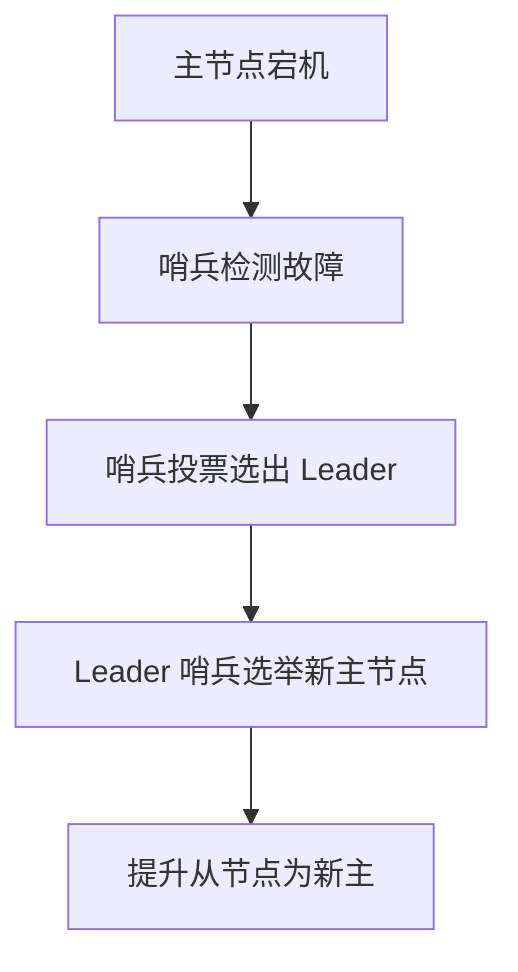
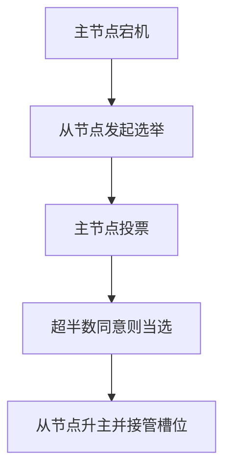

---

UID: 20250327115532 
alias: 
tags: 
source: 
cssclass: 
obsidianUIMode: preview
obsidianEditingMode: live
created: 2025-03-27
---


在 Redis 中，**选举机制根据架构类型不同分为两种**：**哨兵（Sentinel）模式** 和 **集群（Cluster）模式**。两者均实现故障转移，但选举逻辑完全不同。以下是详细对比：

---

### **一、哨兵模式（Sentinel）的选举**
#### **1. 选举角色**
• **参与者**：哨兵节点（Sentinel），独立于 Redis 数据节点的监控进程。
• **被选举者**：主节点（Master）的从节点（Slave）。

#### **2. 选举流程**

1. **故障检测**：
   • 多个哨兵通过 `PING` 检测主节点状态，超过半数的哨兵认为主节点下线，则触发 **客观下线（ODOWN）**。
2. **哨兵 Leader 选举**：
   • 使用 **Raft 算法**，哨兵节点投票选出 Leader，负责执行故障转移。
3. **选举新主节点**：
   • Leader 哨兵根据从节点的 **优先级（priority）**、**复制偏移量（offset）** 等条件，选择最优从节点提升为新主。
   • **条件优先级**：
     ◦ 优先级高的从节点优先。
     ◦ 复制偏移量最大（数据最接近原主节点）。

#### **3. 适用场景**
• **传统主从架构**（非 Cluster 模式），需人工分片。
• 示例：一主两从 + 三个哨兵节点。

---

### **二、集群模式（Cluster）的选举**
#### **1. 选举角色**
• **参与者**：集群中的主节点（Master）。
• **被选举者**：故障主节点的从节点（Slave）。

#### **2. 选举流程**

1. **故障检测**：
   • 集群节点通过 **Gossip 协议** 交换状态信息，若多数主节点认为某主节点下线，标记为 **FAIL**。
2. **从节点发起选举**：
   • 故障主节点的所有从节点尝试发起选举。
3. **主节点投票**：
   • 存活的主节点投票（每个主节点一票），需获得 **超半数票数（N/2 + 1）**。
4. **新主上任**：
   • 当选从节点升主，接管故障主节点的所有槽位。

#### **3. 适用场景**
• **Redis Cluster 集群架构**，数据自动分片（哈希槽）。
• 示例：三主三从，每个主节点管理部分槽位。

---

### **三、核心区别总结**
| **维度**         | **哨兵模式（Sentinel）**              | **集群模式（Cluster）**               |
|------------------|-------------------------------------|-------------------------------------|
| **选举触发者**    | 哨兵节点投票选出 Leader              | 从节点自主发起选举                   |
| **选举参与者**    | 哨兵节点                            | 集群中的其他主节点                   |
| **数据分片**      | 无自动分片，需人工划分               | 自动分片（16384 个哈希槽）           |
| **适用架构**      | 传统主从架构（非集群）               | 原生 Cluster 集群                    |
| **选举依据**      | 从节点优先级、复制偏移量             | 主节点投票结果                       |

---

### **四、选举机制示意图**
#### **1. 哨兵模式选举**
```
+----------+       +----------+       +----------+
| Sentinel | <---> | Sentinel | <---> | Sentinel |
+----------+       +----------+       +----------+
      ↓                   ↓                   ↓
+----------+       +----------+       +----------+
| 主节点    |       | 从节点    |       | 从节点    |
+----------+       +----------+       +----------+
```
• **故障转移流程**：  
  哨兵 Leader 选择一个从节点提升为新主，其他从节点切换复制目标。

#### **2. 集群模式选举**
```
+----------+ (主)       +----------+ (主)       +----------+ (主)
| 节点A    | <-------> | 节点B    | <-------> | 节点C    |
+----------+           +----------+           +----------+
     ↑                      ↑                      ↑
+----------+ (从)       +----------+ (从)       +----------+ (从)
| 节点A'   |            | 节点B'   |            | 节点C'   |
+----------+            +----------+            +----------+
```
• **故障转移流程**：  
  主节点 B 宕机后，其从节点 B' 发起选举，主节点 A 和 C 投票决定 B' 是否升主。

---

### **五、运维建议**
1. **哨兵模式**：
   • 至少部署 3 个哨兵节点（避免脑裂）。
   • 监控哨兵日志，确保故障转移及时触发。
2. **集群模式**：
   • 每个分片至少 1 个从节点。
   • 确保主节点分布在不同的物理机或机架。

---

### **总结**
• **哨兵模式** 的选举由哨兵节点主导，适合传统主从架构。
• **集群模式** 的选举由从节点发起、主节点投票，适合分布式集群场景。
• 两者均保障高可用，但 Cluster 模式额外解决数据分片问题。

