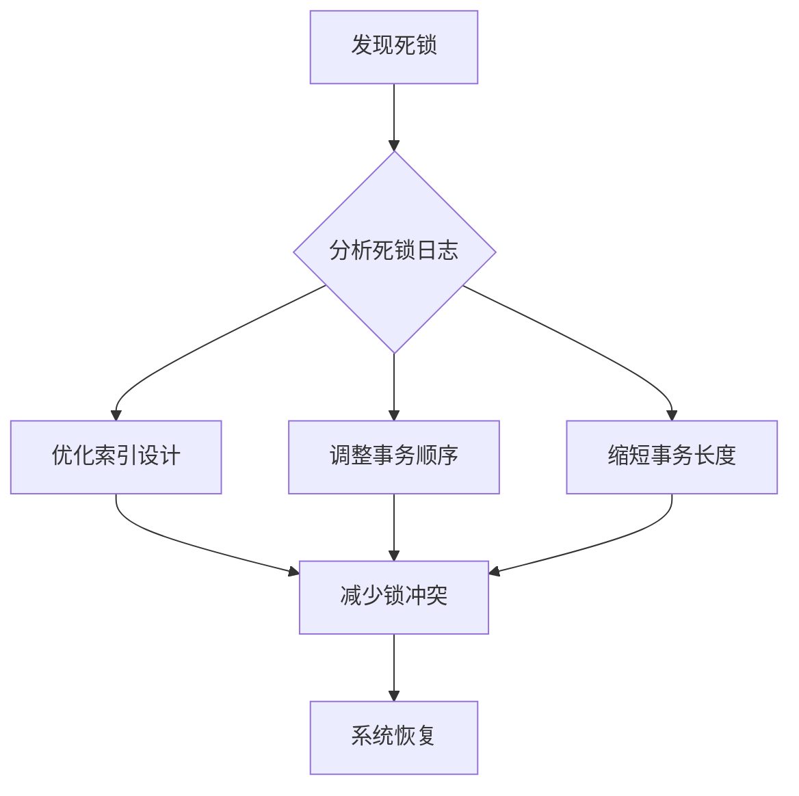

---

UID: 20250325182050 
alias: 
tags: 
source: 
cssclass: 
obsidianUIMode: preview
obsidianEditingMode: live
created: 2025-03-25
---


---

### MySQL 避免死锁的 8 大核心策略（附代码示例）

---

#### **1. 理解死锁的本质**
死锁是多个事务相互等待对方释放资源形成的循环阻塞。例如：
```
事务A：锁定行1 → 请求行2
事务B：锁定行2 → 请求行1
```
InnoDB 会自动检测死锁并回滚代价较小的事务，但需从根源减少发生概率。

---

#### **2. 保持事务简短**
- **原则**：事务越短，持有锁的时间越少，冲突概率越低。
- **优化示例**：
  ```sql
  -- 不推荐：长事务（包含多个无关操作）
  BEGIN;
  UPDATE account SET balance = balance - 100 WHERE user_id = 1;
  -- ... 其他业务逻辑（如日志记录、通知）...
  UPDATE account SET balance = balance + 100 WHERE user_id = 2;
  COMMIT;

  -- 推荐：拆分事务
  BEGIN;
  UPDATE account SET balance = balance - 100 WHERE user_id = 1;
  COMMIT;

  BEGIN;
  UPDATE account SET balance = balance + 100 WHERE user_id = 2;
  COMMIT;
  ```

---

#### **3. 按固定顺序访问资源**
- **原则**：所有事务按相同顺序访问表和行，打破循环等待。
- **场景示例**：
  ```sql
  -- 正确顺序：先更新表A，再更新表B
  -- 事务1和事务2均按此顺序执行
  UPDATE table_a SET ... WHERE id = 1;
  UPDATE table_b SET ... WHERE id = 2;

  -- 错误顺序：事务1先A后B，事务2先B后A → 可能死锁
  ```

---

#### **4. 合理设计索引**
- **原则**：确保查询走索引，减少锁范围和锁冲突。
- **示例**：
  ```sql
  -- 无索引导致全表扫描（退化为表锁）
  UPDATE users SET status = 1 WHERE age > 30; -- age无索引 → 高风险

  -- 添加索引后优化
  CREATE INDEX idx_age ON users(age);
  UPDATE users SET status = 1 WHERE age > 30; -- 走索引 → 行级锁
  ```

---

#### **5. 避免长事务**
- **原则**：长事务会长时间占用锁资源，增加死锁概率。
- **操作建议**：
  - 监控长事务：`SELECT * FROM information_schema.INNODB_TRX;`
  - 设置超时终止：`SET SESSION innodb_lock_wait_timeout = 30;`（单位：秒）

---

#### **6. 降低隔离级别**
- **原则**：低隔离级别（如 `READ COMMITTED`）减少锁范围。
- **配置方法**：
  ```sql
  -- 设置会话级隔离级别
  SET SESSION TRANSACTION ISOLATION LEVEL READ COMMITTED;

  -- 查询当前隔离级别
  SELECT @@transaction_isolation;
  ```

---

#### **7. 显式加锁控制**
- **原则**：使用 `FOR UPDATE` 或 `LOCK IN SHARE MODE` 明确锁定所需资源。
- **示例**：
  ```sql
  -- 提前锁定资源，避免隐式锁竞争
  BEGIN;
  SELECT * FROM orders WHERE id = 100 FOR UPDATE; -- 明确加排他锁
  UPDATE orders SET amount = 200 WHERE id = 100;
  COMMIT;
  ```

---

#### **8. 死锁监控与分析**
- **查看死锁日志**：
  ```sql
  SHOW ENGINE INNODB STATUS; -- 查看 LATEST DETECTED DEADLOCK 部分
  ```
- **日志关键信息解析**：
  ```
  *** (1) TRANSACTION: 更新 users 表 id=1
  *** (1) HOLDS THE LOCK(S): 行锁（主键索引）
  *** (2) TRANSACTION: 更新 users 表 id=2
  *** (2) HOLDS THE LOCK(S): 行锁（主键索引）
  *** WE ROLL BACK TRANSACTION (2) -- InnoDB 自动回滚事务2
  ```

---

### **总结：死锁处理流程图**


---

### **高频死锁场景与解决方案**
| **场景**                  | **解决方案**                              |
|---------------------------|-----------------------------------------|
| 并发批量更新同一张表       | 使用分批提交（LIMIT子句）                |
| 事务顺序不一致导致循环等待 | 统一资源访问顺序                        |
| 无索引全表扫描            | 添加必要索引，强制走索引查询            |
| 长事务占用锁资源          | 拆分事务，设置锁超时时间                |

通过结合索引优化、事务控制、锁策略调整和监控分析，可显著降低死锁发生概率。


