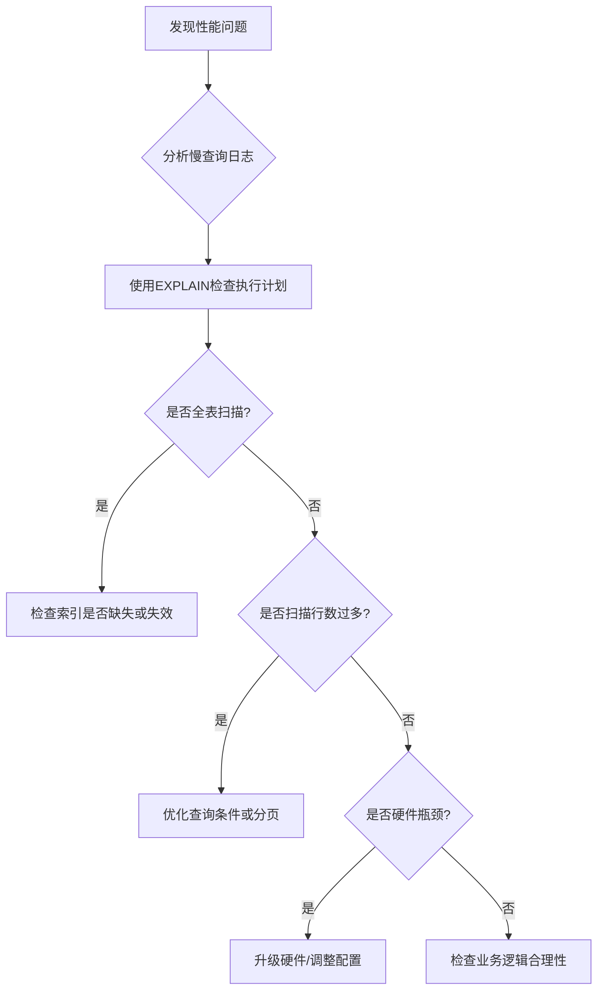

---

UID: 20250324120911 
alias: 
tags: 
source: 
cssclass: 
obsidianUIMode: preview
obsidianEditingMode: live
created: 2025-03-24
---


以下是SQL优化的核心手段，结合场景和优先级分类整理，帮助您快速提升数据库性能：

---

### 一、**索引优化（最高优先级）**
#### 1. **合理创建索引**
   - **高频查询字段**：对`WHERE`、`JOIN`、`ORDER BY`涉及的字段建索引。
   - **复合索引顺序**：遵循**最左前缀原则**，区分度高的字段放左侧。
     ```sql
     -- 复合索引示例：优先用 city 筛选，再用 age 排序
     CREATE INDEX idx_city_age ON users (city, age);
     ```

#### 2. **避免索引失效**
   - **禁止对索引列做运算或函数转换**：
     ```sql
     -- ❌ 错误：索引失效
     SELECT * FROM users WHERE YEAR(create_time) = 2023;
     -- ✅ 优化：使用范围查询
     SELECT * FROM users WHERE create_time BETWEEN '2023-01-01' AND '2023-12-31';
     ```
   - **避免前导通配符模糊查询**：
     ```sql
     -- ❌ 错误：无法使用索引
     SELECT * FROM products WHERE name LIKE '%手机%';
     -- ✅ 优化：使用搜索引擎（如Elasticsearch）替代
     ```

#### 3. **删除冗余索引**
   - 定期使用`SHOW INDEX FROM table`分析索引使用率，删除未使用的索引。

---

### 二、**查询语句优化**
#### 1. **减少数据扫描量**
   - **避免`SELECT ***`：明确指定所需字段，减少网络传输和内存占用。
     ```sql
     -- ❌ 低效
     SELECT * FROM orders;
     -- ✅ 优化
     SELECT order_id, amount, status FROM orders;
     ```

#### 2. **分页优化**
   - **避免深分页**：使用`WHERE`+`LIMIT`替代`OFFSET`。
     ```sql
     -- ❌ 性能差（扫描前10万行）
     SELECT * FROM logs LIMIT 100000, 10;
     -- ✅ 优化：记录上一页最后一条ID
     SELECT * FROM logs WHERE id > 100000 LIMIT 10;
     ```

#### 3. **避免复杂JOIN**
   - **大表JOIN拆分**：将多次查询+程序内存计算替代单次JOIN。
   - **冗余字段**：适当冗余高频查询字段，减少关联查询。

---

### 三、**数据库设计优化**
#### 1. **冷热数据分离**
   - 将历史数据归档到历史表，减少主表数据量。

#### 2. **字段设计规范**
   - 使用`NOT NULL`约束，避免`NULL`值导致索引复杂度上升。
   - 小数据类型优先（如`INT`替代`BIGINT`，`VARCHAR(255)`避免过长）。

#### 3. **分库分表**（数据量>千万级时）
   - **垂直拆分**：按业务模块拆分（如用户库、订单库）。
   - **水平拆分**：按哈希或范围分表（如订单按用户ID分表）。

---

### 四、**执行计划分析**
#### 1. **使用`EXPLAIN`诊断**
   ```sql
   EXPLAIN SELECT * FROM users WHERE age > 30;
   ```
   - **核心关注列**：
     - `type`：`ALL`（全表扫描）需优化为`index`或`range`。
     - `key`：是否命中索引。
     - `rows`：扫描行数（越小越好）。

#### 2. **慢查询日志分析**
   - 开启慢查询日志，定期分析`long_query_time`（如>1秒的SQL）。

---

### 五、**其他高级手段**
#### 1. **硬件/配置优化**
   - 升级SSD硬盘，提升I/O性能。
   - 调整`innodb_buffer_pool_size`（建议为内存的70%~80%）。

#### 2. **缓存策略**
   - 使用Redis缓存热点数据（如商品信息）。
   - 开启数据库查询缓存（注意：MySQL 8.0已移除该功能）。

#### 3. **批量操作替代循环**
   ```sql
   -- ❌ 低效
   INSERT INTO users (name) VALUES ('A');
   INSERT INTO users (name) VALUES ('B');
   -- ✅ 优化
   INSERT INTO users (name) VALUES ('A'), ('B');
   ```

---

### 六、**优化流程图**


---

### 总结
- **优化本质是权衡**：在查询速度、写性能、存储成本间平衡。
- **二八原则**：20%的优化手段解决80%的性能问题（如索引+慢查询分析）。
- **持续监控**：使用Prometheus+Grafana等工具监控数据库负载。


