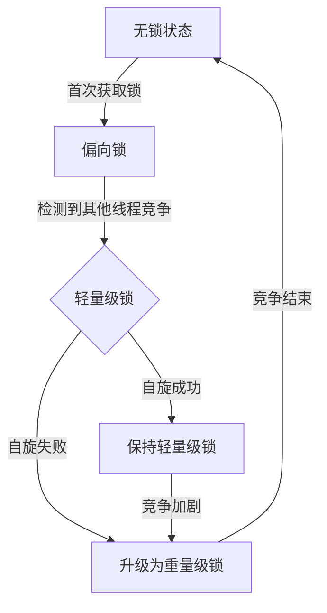
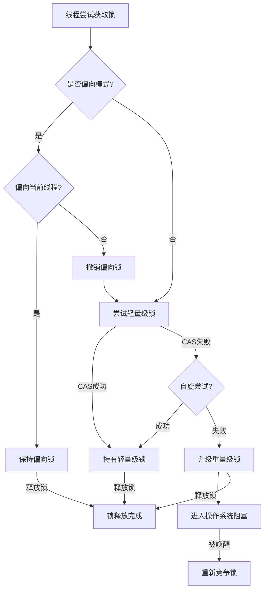

---

UID: 20250319225430 
alias: 
tags: 
source: 
cssclass: 
obsidianUIMode: preview
obsidianEditingMode: live
created: 2025-03-19
---


以下是锁优化机制的详细解析及流程图：

---

### 一、锁优化的核心目标
1. **减少线程阻塞**：降低线程上下文切换开销
2. **提高并发性能**：根据竞争强度动态调整锁策略
3. **避免不必要的同步**：通过编译器和JVM优化消除冗余锁

---

### 二、主要锁优化技术

#### 1. 锁升级机制（JDK 6+）
| 锁级别      | 实现原理                          | 适用场景               | 特点                        |
|------------|-----------------------------------|----------------------|----------------------------|
| **偏向锁** | 记录线程ID，CAS验证               | 单线程重复获取锁       | 零额外开销                  |
| **轻量级锁** | 自旋+CAS竞争                    | 低并发短时竞争        | 避免线程阻塞                |
| **重量级锁** | 操作系统互斥量（Mutex）          | 高并发长时竞争        | 真正的线程阻塞              |

> [!note]
> **自旋**：由于大部分时候，锁被占用的时间很短，共享变量的锁定时间也很短，所有没有必要挂起线程，用户态和内核态的来回上下文切换严重影响性能。自旋的概念就是让线程执行一个忙循环，可以理解为就是啥也不干，防止从用户态转入内核态，自旋锁可以通过设置-XX:+UseSpining来开启，自旋的默认次数是10次，可以使用-XX:PreBlockSpin设置
#### 锁升级流程：


#### 2. 自旋优化
- **自适应自旋**（JDK 6+）：
  - 根据前一次自旋成功率动态调整自旋次数
  - 成功率高则增加自旋次数，反之减少

#### 3. 锁消除（Lock Elimination）
- **逃逸分析**：检测不可能存在共享竞争的同步代码
- **示例**：
  ```java
  public String concat(String s1, String s2) {
      // StringBuffer内部同步操作会被消除
      return new StringBuffer().append(s1).append(s2).toString();
  }
  ```

#### 4. 锁粗化（Lock Coarsening）
- 合并相邻的同步块减少锁操作次数：
  ```java
  // 优化前
  for(int i=0; i<100; i++){
      synchronized(lock){ ... }
  }
  
  // 优化后
  synchronized(lock){
      for(int i=0; i<100; i++){ ... }
  }
  ```

---

### 三、完整锁优化流程图


---

### 四、优化策略建议
1. **减少锁粒度**  
   使用细粒度锁（如`ConcurrentHashMap`的分段锁）
   
2. **缩短锁持有时间**  
   同步块内只保留必要操作：
   ```java
   // 不推荐
   synchronized(lock) {
       loadData();  // 耗时IO操作
       process();
   }
   
   // 推荐
   Data data = loadData();  // 非同步操作
   synchronized(lock) {
       process(data);
   }
   ```

3. **使用读写锁**  
   区分读写场景使用`ReentrantReadWriteLock`：
   ```java
   ReadWriteLock rwLock = new ReentrantReadWriteLock();
   void readData() {
       rwLock.readLock().lock();
       try { /* 读操作 */ } 
       finally { rwLock.readLock().unlock(); }
   }
   ```

4. **无锁编程**  
   优先使用原子类（`AtomicInteger`等）或`CAS`操作：
   ```java
   AtomicInteger counter = new AtomicInteger();
   counter.incrementAndGet(); // 无锁线程安全操作
   ```

---

### 五、性能对比场景
| 场景                | 偏向锁          | 轻量级锁        | 重量级锁        |
|--------------------|----------------|----------------|----------------|
| 单线程重复获取锁     | 0.5ns          | 5ns            | 100ns+         |
| 两个线程交替访问     | 不适用          | 20ns (10次CAS) | 1000ns+        |
| 10线程激烈竞争       | 不适用          | 不适用          | 稳定微秒级      |

---

### 六、监控工具
1. **JOL (Java Object Layout)**  
   分析对象头中的锁状态：
   ```java
   // 添加依赖
   <dependency>
       <groupId>org.openjdk.jol</groupId>
       <artifactId>jol-core</artifactId>
       <version>0.16</version>
   </dependency>
   
   // 查看锁状态
   System.out.println(ClassLayout.parseInstance(obj).toPrintable());
   ```

2. **JStack**  
   检测线程锁竞争情况：
   ```bash
   jstack <pid> | grep -A 10 java.lang.Thread.State
   ```

---

### 总结
现代JVM通过多级锁优化机制，在保证线程安全的前提下最大程度提升并发性能。开发者应：
1. 理解不同锁状态的特征
2. 结合业务场景选择合适的同步策略
3. 通过监控工具验证优化效果
4. 优先考虑无锁或低锁竞争方案

最终的优化效果需要通过压力测试验证，建议使用JMH（Java Microbenchmark Harness）进行基准测试。
